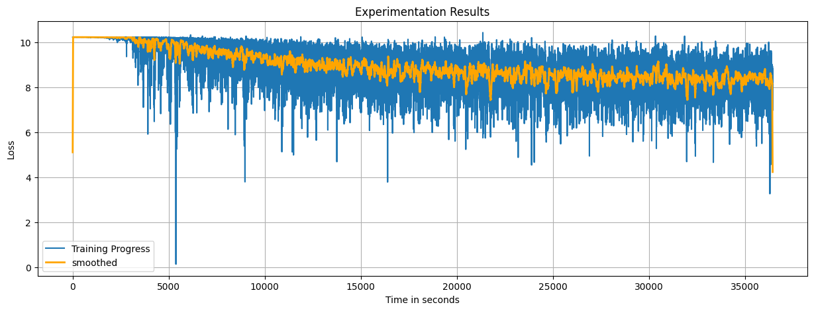

# Word2vec implementation with numpy

## Motivation: Jetbrain intership aplication

Implement the core training loop of word2vec in **pure NumPy** (no PyTorch / TensorFlow or other ML frameworks). The applicant is free to choose any suitable text dataset. The task is to implement the optimization procedure (**forward pass, loss, gradients, and parameter updates**) for a standard word2vec variant (e.g. skip-gram with negative sampling or CBOW).
The submitted solution should be fully understood by the applicant: during follow-up we will ask questions about the code, gradient derivation, and possible alternative implementations or optimizations.
Preferably, solutions should be provided as a link to a public GitHub repository.

## External sources

|Source|
|------|
|[Efficient Estimation of Word Representations in Vector Space Tomas Mikolov, Kai Chen, Greg Corrado, Jeffrey Dean](https://arxiv.org/pdf/1301.3781)|
|[Word2vec with gensim](https://www.geeksforgeeks.org/nlp/word2vec-with-gensim/)|
|[Backpropagation](https://www.geeksforgeeks.org/machine-learning/backpropagation-in-neural-network/)|

## Implementation route

1. **Data processing**
    - Tokenization
    - Lowercasting
    - Removing stopwords
    - Removing low frecuency words
2. **Vocabulary Indexer**
    - Token2index and Index2token
3. **One layer linear neural network with backpropagation**
    - Softmax activation function
    - Foward pass
    - Loss: multiclass cross entropy loss
    - Gradient calculation
        - Output error
    - Weight updates
4. **Countinuous bag of words architecture**
    - Neural network feeding
        - Input: Context window
        - Output: Target
# Experimentation #1

## Dataset
The dataset used for training process is from the popular [Hugging Face Dataset libraries](https://github.com/huggingface/datasets); specifically, it is a reduced version of Wikipedia.

|Dataset|total tokens|unique tokens|
|---|---|---|
|raw dataset|2,051,910|+60,000 (3%)|
|clean dataset|1,439,103 (-30%)|27,506 (2%)|

## Parameters initialization values
|Parameters|value|
|---|---|
|Epoch|1|
|Batch|32|
|Learning rate|0.1|
## Results

|Stats||
|---|---|
|Final loss avg|8 aprox.|
|Time spended|10 hours 7 min 14 sec|
|Machine|Codespaces  4-core 16GB RAM 32GB|